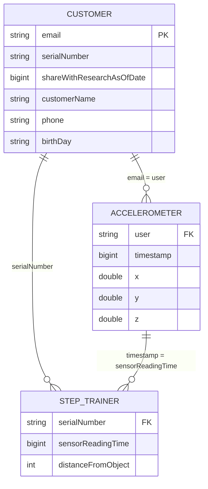
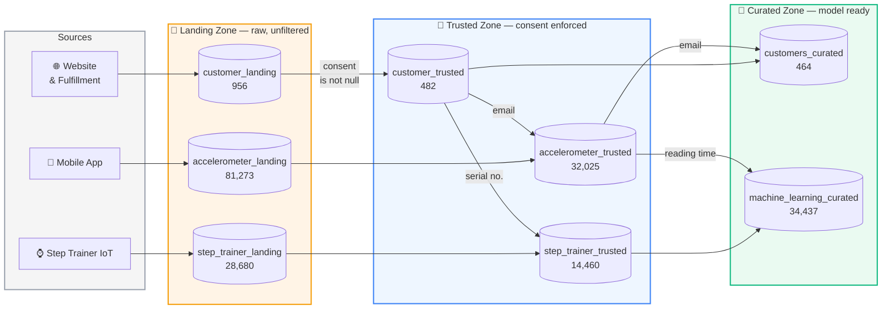

<div align="center">

# STEDI Human Balance Analytics

**A privacy-first data lakehouse on AWS that curates IoT sensor data into a machine learning training set.**

[](https://aws.amazon.com/glue/)
[](https://aws.amazon.com/s3/)
[](https://aws.amazon.com/athena/)
[](https://spark.apache.org/)
[](https://www.python.org/)

</div>

---

## Table of Contents

- [The Objective](#the-objective)
- [The Data](#the-data)
- [Architecture](#architecture)
- [The Pipeline](#the-pipeline)
- [Privacy Engineering](#privacy-engineering)
- [Data Quality: The Serial Number Defect](#data-quality-the-serial-number-defect)
- [Row Count Contract](#row-count-contract)
- [Repository Layout](#repository-layout)
- [Running the Project](#running-the-project)
- [Implementation Notes](#implementation-notes)

---

## The Objective

STEDI has built a hardware **Step Trainer** — a balance-training device with a
motion sensor — paired with a mobile app that reads the phone's accelerometer.
Early adopters are already using both.

The data science team wants to train a model that detects steps in real time.
To do that they need a single table where **each Step Trainer distance reading
sits alongside the accelerometer reading captured at the same instant**.

The catch is consent. Only a subset of customers agreed to share their data for
research, and that agreement has a *date*. The job of this project is to move
data from raw JSON to a model-ready table while making the privacy rules
explicit, auditable, and impossible to bypass — not to bolt them on at the end.

The result is `machine_learning_curated`: **34,437 rows, zero personal
identifiers.**

---

## The Data

Three JSON feeds land in S3, one per source system.

| Source | Feed | Rows | Key fields |
|--------|------|-----:|------------|
| STEDI website & fulfillment | `customer` | 956 | `email`, `serialNumber`, `shareWithResearchAsOfDate` |
| Companion mobile app | `accelerometer` | 81,273 | `user` (email), `timestamp`, `x`, `y`, `z` |
| Step Trainer IoT device | `step_trainer` | 28,680 | `serialNumber`, `sensorReadingTime`, `distanceFromObject` |

They join through two different keys, which is what makes the pipeline
interesting:



All timestamp-ish fields (`shareWithResearchAsOfDate`, `timestamp`,
`sensorReadingTime`, `registrationDate`, …) are **Unix epoch milliseconds**, so
every temporal comparison in this project is plain integer arithmetic — no date
parsing, no timezone ambiguity.

---

## Architecture

A three-zone lakehouse. Data only ever moves *forward*, and every hop is a Glue
job that narrows the dataset according to one explicit rule.



**Why three zones?** Each one answers a different question, so a failure is
always localised to a single, testable rule:

| Zone | Question it answers | Guarantee |
|------|--------------------|-----------|
| 🥉 **Landing** | *What did the source systems actually send?* | Byte-faithful copy. Never mutated — the audit baseline. |
| 🥈 **Trusted** | *What are we legally allowed to use?* | Every row belongs to a customer who consented, and was captured while that consent was active. |
| 🥇 **Curated** | *What is actually useful downstream?* | Joined, de-duplicated, business-ready, and stripped of PII. |

---

## The Pipeline

Five Glue jobs, each one node-for-node reproducible in Glue Studio.

| # | Job | In → Out | Rule enforced |
|---|-----|----------|---------------|
| 1 | [`customer_landing_to_trusted.py`](scripts/customer_landing_to_trusted.py) | `customer_landing` → `customer_trusted` | Drop customers with no research consent on record |
| 2 | [`accelerometer_landing_to_trusted.py`](scripts/accelerometer_landing_to_trusted.py) | `accelerometer_landing` ⋈ `customer_trusted` → `accelerometer_trusted` | Consenting customers only, **and** reading taken at/after consent |
| 3 | [`customer_trusted_to_curated.py`](scripts/customer_trusted_to_curated.py) | `customer_trusted` ⋈ `accelerometer_trusted` → `customers_curated` | Keep only customers who actually produced usable readings |
| 4 | [`step_trainer_trusted.py`](scripts/step_trainer_trusted.py) | `step_trainer_landing` ⋈ `customer_trusted` → `step_trainer_trusted` | Resolve the real device owner, consenting customers only |
| 5 | [`machine_learning_curated.py`](scripts/machine_learning_curated.py) | `step_trainer_trusted` ⋈ `accelerometer_trusted` → `machine_learning_curated` | Align both sensors on a shared instant, **drop all PII** |

Every job follows the same shape:

```
S3 / Data Catalog source  →  Transform: SQL Query  →  S3 sink (+ Catalog update)
```

Two deliberate conventions:

- **`Transform - SQL Query` nodes instead of Join/Filter nodes.** The business
  rule ends up readable as plain SQL that a reviewer — or a privacy officer —
  can verify without reading PySpark. It also avoids the inconsistent output
  the visual Join node produces on these datasets.
- **`enableUpdateCatalog=True` + `updateBehavior="UPDATE_IN_DATABASE"`** on
  every sink. This is Glue Studio's *"Create a table in the Data Catalog and,
  on subsequent runs, update the schema and add new partitions"* option: the
  schema is inferred from the data and kept in sync, so no downstream table is
  ever hand-defined.

---

## Privacy Engineering

Consent is treated as a *temporal* fact, not a boolean.

### 1. Consent must exist

A customer who never agreed to research simply **omits** the
`shareWithResearchAsOfDate` key in the raw feed — it is not an empty string, it
is an absent field, surfaced by the SerDe as `NULL`.

```sql
SELECT * FROM customer_landing
WHERE sharewithresearchasofdate IS NOT NULL     -- 956 → 482
```

### 2. Consent must have existed *at capture time*

A reading taken before the customer opted in was never covered by that consent.
Keeping it would mean that if the customer later revokes consent, we could not
demonstrate the data was lawfully gathered. So the accelerometer join carries a
cut-off:

```sql
INNER JOIN customer_trusted c ON a.user = c.email
WHERE a.`timestamp` >= c.sharewithresearchasofdate    -- 40,981 → 32,025
```

That single predicate discards **8,956 readings** that a naïve consent check
would have happily let through.

### 3. The training set carries no identifiers

`machine_learning_curated` never selects `user` (the customer's email). The
final table holds only sensor telemetry:

```
sensorreadingtime · serialnumber · distancefromobject · x · y · z
```

With no direct identifier, the training set falls outside the scope of a GDPR
erasure request — a deletion can be actioned in the curated customer table
without retraining or rebuilding the model's input.

> `serialnumber` is retained deliberately: it identifies a **device**, not a
> person, and the ML team needs it to group readings per unit. It is only
> re-linkable to a customer through the curated zone, which is precisely where
> an erasure request is actioned.

---

## Data Quality: The Serial Number Defect

A defect in the fulfillment website reused the same handful of serial numbers
across a large number of customer records. `customer_landing.serialnumber`
therefore **cannot be trusted to identify a device**.

The IoT feed, however, reports the *real* serial number. This is why the Step
Trainer data cannot be attributed directly and has to be routed through the
customer tables — job #4 exists specifically to repair this linkage.

**A note on which customer list gates the IoT feed.** The privacy question for a
step trainer reading is only *"did this customer consent to research?"* — that
is `customer_trusted`. Membership of `customers_curated` adds a second,
unrelated condition (*"this customer also produced accelerometer readings"*)
that is a property of the accelerometer feed and says nothing about whether a
step trainer reading may be used.

In the baseline pipeline the distinction is invisible: both tables hold the same
482 customers. Once the consent-date cut-off is applied, 18 consenting customers
drop out of the curated table purely because all their accelerometer readings
pre-date their consent — yet their step trainer readings remain perfectly
legitimate.

This choice does not affect the deliverable: those 540 extra readings have no
accelerometer reading at a matching timestamp, so `machine_learning_curated` is
**34,437 rows either way**.

---

## Row Count Contract

Every table has an exact expected size, verified end to end.

| Zone | Table | Baseline | **This build** (stand-out) |
|------|-------|---------:|---------------------------:|
| 🥉 Landing | `customer_landing` | 956 | **956** |
| 🥉 Landing | `accelerometer_landing` | 81,273 | **81,273** |
| 🥉 Landing | `step_trainer_landing` | 28,680 | **28,680** |
| 🥈 Trusted | `customer_trusted` | 482 | **482** |
| 🥈 Trusted | `accelerometer_trusted` | 40,981 | **32,025** |
| 🥈 Trusted | `step_trainer_trusted` | 14,460 | **14,460** |
| 🥇 Curated | `customers_curated` | 482 | **464** |
| 🥇 Curated | `machine_learning_curated` | 43,681 | **34,437** |

The *stand-out* column is lower wherever the consent-date cut-off applies —
that gap is the whole point of the exercise.

### Verifying without spending a cent

`scripts/validate_pipeline.py` replays every join and filter in pure Python
against the local JSON and asserts each count. It catches a broken predicate in
about a second, before any DPU-hours are spent:

```console
$ python scripts/validate_pipeline.py
TABLE                         EXPECTED    ACTUAL
--------------------------------------------------------
customer_landing                   956       956   PASS
accelerometer_landing            81273     81273   PASS
step_trainer_landing             28680     28680   PASS
customer_trusted                   482       482   PASS
accelerometer_trusted            32025     32025   PASS
customers_curated                  464       464   PASS
step_trainer_trusted             14460     14460   PASS
machine_learning_curated         34437     34437   PASS
--------------------------------------------------------
PII columns in machine_learning_curated: none

All checks passed.
```

The last line is an assertion, not a comment: the harness fails if `user` or
`email` ever reappears in the curated training set.

---

## Repository Layout

```
aws_stedi_human_balance/
├── data/                              # Landing zone source JSON (upload to S3)
│   ├── customer/landing/              #     956 records
│   ├── accelerometer/landing/         #  81,273 records
│   └── step_trainer/landing/          #  28,680 records
│
├── sql/                               # Athena DDL for the landing zone
│   ├── customer_landing.sql           #   + verification queries
│   ├── accelerometer_landing.sql
│   └── step_trainer_landing.sql
│
├── scripts/                           # AWS Glue jobs (PySpark)
│   ├── customer_landing_to_trusted.py         # 1  landing  → trusted
│   ├── accelerometer_landing_to_trusted.py    # 2  landing  → trusted
│   ├── customer_trusted_to_curated.py         # 3  trusted  → curated
│   ├── step_trainer_trusted.py                # 4  landing  → trusted
│   ├── machine_learning_curated.py            # 5  trusted  → curated
│   └── validate_pipeline.py                   #    local test harness
│
├── screenshots/                       # Athena evidence for each table
└── README.md
```

Trusted and curated tables are **not** hand-written DDL — they are created by
the Glue jobs themselves through `enableUpdateCatalog`.

---

## Running the Project

### 1. Stage the data in S3

```bash
BUCKET=s3://stedi-lakehouse

aws s3 cp data/customer/landing/      $BUCKET/customer/landing/      --recursive
aws s3 cp data/accelerometer/landing/ $BUCKET/accelerometer/landing/ --recursive
aws s3 cp data/step_trainer/landing/  $BUCKET/step_trainer/landing/  --recursive
```

> `stedi-lakehouse` is the bucket this project actually runs against, and the
> Glue database is `stedi` — both are already set throughout `scripts/` and
> `sql/`, so no substitution is needed.
>
> To point the pipeline at a different bucket, change the `LANDING_PATH` /
> `TRUSTED_PATH` / `CURATED_PATH` constants at the top of each script in
> `scripts/`, the `LOCATION` clause in each file in `sql/`, and the
> `GLUE_DATABASE` constant if the database name changes too.

### 2. Create the landing zone tables

In the Athena query editor, create the database and run the three DDL scripts:

```sql
CREATE DATABASE IF NOT EXISTS stedi;
```

Then execute `sql/customer_landing.sql`, `sql/accelerometer_landing.sql` and
`sql/step_trainer_landing.sql`. Each file ends with its own verification
queries — capture those results into `screenshots/`.

### 3. Run the Glue jobs **in order**

Order matters: jobs 2–5 read tables produced by earlier jobs.

```
1. customer_landing_to_trusted
2. accelerometer_landing_to_trusted
3. customer_trusted_to_curated
4. step_trainer_trusted            ← ~8 min on 2 DPU
5. machine_learning_curated
```

Each job needs an IAM role with `S3` read/write on the bucket plus
`AWSGlueServiceRole`.

> [!IMPORTANT]
> **Glue jobs append; they do not replace.** Re-running a job on top of an
> existing output will double your row counts. Before any re-run, delete both
> the S3 prefix and the Glue table:
>
> ```bash
> aws s3 rm $BUCKET/customer/trusted/ --recursive
> aws glue delete-table --database-name stedi --name customer_trusted
> ```

### 4. Verify

Run the counts in the [Row Count Contract](#row-count-contract) against each
table in Athena and save the screenshots. Anything that disagrees points at a
re-run without a cleanup, or a predicate that changed.

---

## Implementation Notes

Details that cost real debugging time, recorded so they cost none the next time.

- **`timestamp` is a reserved word.** The accelerometer field is literally named
  `timestamp`. It needs back-quotes in Hive/Spark SQL (`` a.`timestamp` ``) and
  double quotes in Athena (`"timestamp"`). Unquoted, it parses as a type name
  and the query fails.

- **The field is `timestamp`, not `timeStamp`.** The entity diagram in the
  project brief shows `timeStamp`; the actual JSON uses all-lowercase. The
  OpenX SerDe is configured with `case.insensitive = TRUE`, so the Glue table
  resolves either way — but a case-sensitive Spark read would not.

- **Missing ≠ blank.** Non-consenting customers omit the
  `shareWithResearchAsOfDate` key entirely rather than sending `""`. The filter
  must be `IS NULL` / `IS NOT NULL`; a `!= ''` comparison silently keeps every
  one of the 474 non-consenting customers.

- **`SELECT DISTINCT` in job #3 is load-bearing.** Joining customers to their
  accelerometer readings fans each customer out across every reading they
  produced. Without the de-duplication, `customers_curated` returns 32,025 rows
  instead of 464.

- **Not everything is a string.** Epoch fields are `bigint`, `x`/`y`/`z` are
  `double`, `distanceFromObject` is `int`. `phone` and `birthDay` stay strings
  on purpose — `phone` is an identifier rather than a number, and `birthDay`
  contains out-of-range values such as `1323-01-01` that break a strict `DATE`
  cast.

- **Prefer the Data Catalog node over the S3 node for intermediate reads.** The
  S3 source node intermittently returns incomplete data for the trusted tables;
  reading through the Catalog is consistent. Landing-zone reads go straight to
  S3, since no Catalog table has been produced by a job at that point.

---

<div align="center">
<sub>Built as part of the Udacity <b>Data Engineering with AWS</b> Nanodegree.</sub>
</div>
